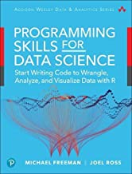
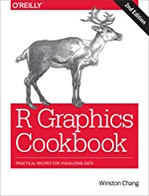
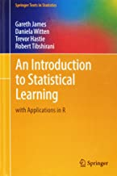

```{r setup, include=FALSE}
knitr::opts_chunk$set(echo = FALSE)
```

## Me

- Alexander Ondrus
    - Chair of Mathematics, NAIT
    - PhD. in Pure Mathematics - University of Alberta, 2010
    - Instruct BTTM4180: Data Visualization for the Bachelor of Technology program at NAIT
    
## Overview

- Introduce R, RStudio, RMarkdown ~ 10 minutes
- Show an example - __YEG Schools__ ~ 20 minutes
    - Code Chunks, Installing Packages, Knitting the Document
- Break ~ 10 minutes
- Walk-through - __Solar Panels at NAIT__ ~ 25 minutes
    - Reading in Data, Visualizing Data, Reshaping Data
- Walk-through - __Mosquito Trap Counts__ ~ 25 minutes
    - Mutating Data, Predictive Modelling

## R

### What is R?

- ["R is a language and environment for statistical computing and graphics."](https://www.r-project.org/about.html)
- Created by Ross Ihaka and Robert Gentleman at the University of Auckland (according to Wikipedia)
- First stable beta version on February 29, 2000 (Happy 5th Birthday!)
- Free GUI and command-line versions available at [www.r-project.org](www.r-project.org)

## Why R?

- Free
- Accomodates Large Data Files
- Reproducible
- Cross-platform
- Includes packages for:
    - Data Manipulation
    - Statistical Analysis
    - Visualization
    - Machine Learning...

## RStudio

- **I**ntegrated **D**evelopment **E**nvironment (IDE) for R
- Runs "on top of" R (i.e. need R first)
- Four panes:
    - *Console*: Lines of code run instantly and interactively
    - *Environment*: Variables and stored data
    - *Plots*: Output of plots generated in the console
    - *Scripts*: Many different kinds, we will focus on .R and .Rmd

## RMarkdown

- Integrate code, output, and formatted text in a single document (like this one!)
- All of the above appear as code in RStudio and then the result is _Knit_ together to produce formatted output
- Uses [Markdown](https://www.markdownguide.org/basic-syntax/) syntax integrated with R code
- Pre-fabricated example:
    - [YEG Schools Example](https://github.com/alex-ondrus/yeg_schools_eg)
    - Download (or clone) the repo and open:
        1. YEG_schools.Rmd (in RStudio)
        2. YEG_schools.html (in any web browser)

## YEG Schools Example


- When the .Rmd file is knit, the HTML is produced
- Before knitting will work, need to:
    - Install packages (warning comes up automatically)
    - Download data _to the same working directory_
        - Only for the files that are not accessible by URL
    - Put a hashtag (comment character) in front of the `animate` command (or we will be here all day)

## Packages

- Extend R's ability
- Being developed constantly
- Installed using `install.packages()`

```
install.packages("tidyverse")
```

- Once installed, need to be loaded with `library()`

```{r Loading packages example, echo=TRUE, message=FALSE, warning=FALSE}
library(tidyverse)
```

- __Note:__ Quotations needed inside the install command but _not_ the load command
- All of this is done with one click in RStudio when a file is opened that contains new packages

## Solar Panels at NAIT

- Pilot project started in 2012
- 6 solar panels installed at different angles
- Data collected until August 2014 available [here](https://data.edmonton.ca/Environmental-Services/Historical-City-of-Edmonton-NAIT-Solar-Panel-Refer/uwuq-3zq3)
- Data file is too big for GitHub
    - Download from the open data catalogue as a CSV and save to _same directory_

### Question: How does power depend on the date?

### Question: Which angle produces the best power?

- Open `solar_eg.Rmd`

## Mosquito Traps & Rainfall

- Data collected for both rainfall [here](https://data.edmonton.ca/Environmental-Services/Rainfall-Gauge-Results/7fus-qa4r) and mosquito traps [here](https://data.edmonton.ca/Environmental-Services/Mosquitoes-Trap-Data-May-2011-to-Sep-2015-/5zeu-wkpv)
- Mosquito traps checked _weekly_
- Rainfall measured _daily_

### Question: How well does mean rainfall predict total mosquitoes caught?

- Open `mosquitoes_eg.Rmd`

## References: Data Wrangling



- _Programming Skills for Data Science: Start Writing Code to Wrangle, Analyze, and Visualize Data with R_ by **Michael Freeman and Jeol Ross**

## References: Data Visualization


- _Data Visualization: A Practical Introduction_ by **Kieran Healy**

## References: Data Visualization



- _R Graphics Cookbook: Practical Recipies for Visualizing Data_ by **Winston Chang**

## References: Statistical Learning



- _An Introduction to Statistical Learning: with Applications in R_ by **Gareth James, Daniela Witten, et al.**
